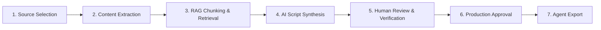
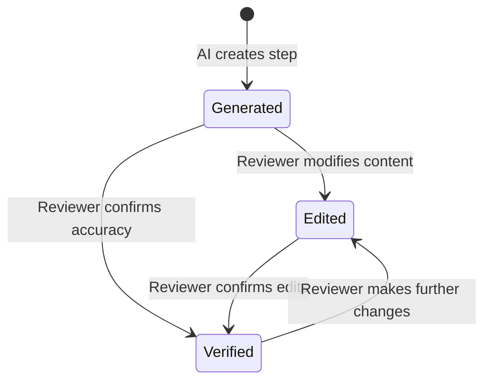
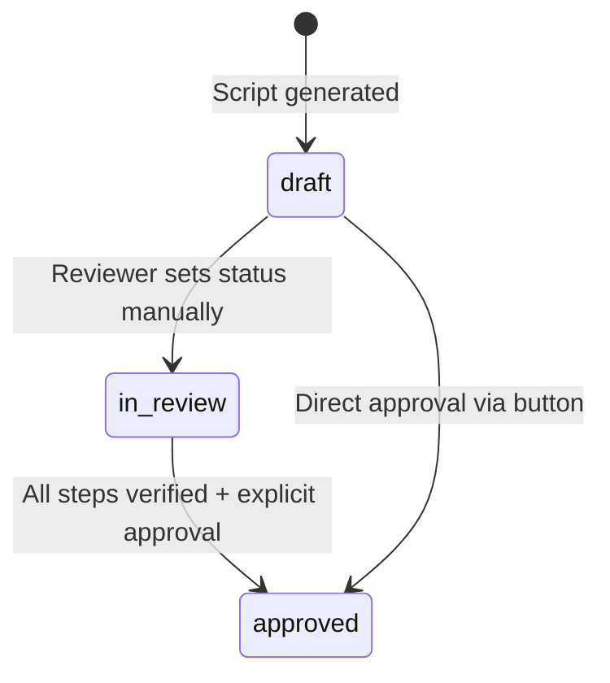
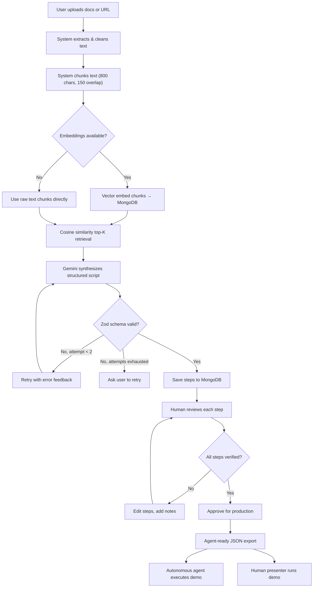

# Decision Framework — Demo Script Builder

How every decision is made, from raw documentation to a production-ready, agent-executable demo script.

---

## Decision Lifecycle Overview



Every demo script passes through **seven decision gates** before it reaches an autonomous agent or a live presenter. Each gate is designed so that **AI handles scale** (reading docs, structuring steps) and **humans handle trust** (verifying accuracy, approving for production).

---

## Source Selection Decision

**Who decides:** The user

**What is decided:**
- Whether to upload a file (PDF, TXT, MD, JSON) or scrape a live URL
- Which specific documentation pages to include as source material
- What the demo focus or emphasis should be (optional `focus` parameter)

**How it works:**
1. The user navigates to the `/new` creation page.
2. They either upload a file via multipart form or provide a documentation URL.
3. They set a demo `title`, optional `customerName`, and an optional `focus` query describing what the demo should emphasize.

**Decision criteria:**
| Input Type | Best For |
|---|---|
| PDF Upload | Offline product docs, spec sheets, whitepapers |
| TXT / MD Upload | Changelogs, feature lists, release notes |
| URL Scrape | Live documentation sites, help centers, landing pages |

> [!TIP]
> The `focus` field is the single most impactful decision the user makes — it directly steers which RAG chunks get retrieved and how the LLM prioritizes content.

---

## Content Extraction Decision

**Who decides:** The system (automated)

**What is decided:**
- How to parse the uploaded document or scraped page
- What content to keep vs. discard
- How much content to pass forward

**Decision logic in `app/api/scrape/route.ts`:**

```
IF content-type is multipart/form-data:
  IF file extension is .pdf:
    TRY primary pdf-parse library
    FALLBACK TO regex-based text stream extraction (Tj/TJ operators)
  ELSE:
    Read file buffer as UTF-8 text
ELSE IF content-type is JSON (URL scrape):
  Fetch URL with browser User-Agent header
  Parse HTML with Cheerio
  STRIP: <script>, <style>, <nav>, <footer>, <iframe>, <svg>, <noscript>
  EXTRACT: <main>, <article>, #content, .content, or <body>
  CAP at 30,000 characters
```

**Key design decisions:**
- **30K character cap** — Prevents token overflow in downstream LLM calls while preserving enough context for comprehensive script generation.
- **Boilerplate stripping** — Navigation, footer, and script tags are noise for demo scripting; removing them ensures the LLM focuses on actual product documentation.
- **PDF fallback chain** — The binary stream regex fallback (`Tj`/`TJ` operators) catches PDFs where the primary parser fails in serverless environments.

---

## RAG Chunking & Retrieval Decision

**Who decides:** The system (algorithmic + AI embeddings)

**What is decided:**
- How to split documentation into retrievable knowledge chunks
- Which chunks are most relevant to the demo's focus
- Whether to use vector search or fall back to direct text

**Decision flow in `lib/llm/rag.ts`:**

### Step a: Chunking Strategy

```
Split text into 800-character chunks with 150-character overlap
Break at word boundaries (nearest space after midpoint)
Store each chunk with its source document title and URL
```

| Parameter | Value | Rationale |
|---|---|---|
| Chunk size | 800 chars | Small enough for precise retrieval, large enough for coherent context |
| Overlap | 150 chars | Prevents information loss at chunk boundaries |
| Word boundary split | Nearest space after 50% of chunk size | Avoids cutting mid-sentence |

### Step b: Embedding Model Cascade

```
TRY text-embedding-004 (primary)
  ↓ on 404
TRY embedding-001 (fallback)
  ↓ on any API error
DISABLE embeddings entirely → use Direct Text RAG
```

> [!IMPORTANT]
> The **graceful degradation** to Direct Text RAG is a critical resilience decision. If the user's Gemini API key doesn't have embedding access, the system still generates scripts by passing raw text chunks directly — it just loses semantic ranking precision.

### Step c: Relevance Ranking

```
Compute cosine similarity between:
  - Query embedding (from user's focus + page titles)
  - Each stored chunk embedding

Rank by similarity score (descending)
Return top-K chunks (default: 8–10)

IF query embedding is empty (embeddings disabled):
  Return first K chunks in document order (positional fallback)
```

---

## AI Script Synthesis Decision

**Who decides:** Gemini 2.5 Flash LLM 

**What is decided:**
- How many steps the demo should have (5–12)
- What action type each step uses (`navigate`, `click`, `input`, `highlight`, `wait`, `say`, `scroll`)
- The narrative arc and ordering of steps
- What narration text the presenter says at each step
- What expected outcomes verify each step succeeded

**Decision rules enforced by the system prompt (`lib/llm/prompt.ts`):**

| Rule | Purpose |
|---|---|
| Ground every step in provided documentation | Prevents hallucinated features |
| Include `sourceRef` with verbatim excerpt (<300 chars) | Enables human fact-checking |
| Order as narrative arc: orient → build value → close | Creates compelling demo flow |
| Use benefit-oriented narration voice | Sounds like a real sales demo |
| 5–12 steps, fewer is better | Quality over padding |
| Return only valid JSON matching `GeneratedScriptSchema` | Machine-parseable output |

### Action Type Decision Matrix

The LLM selects action types based on these guidelines from the system prompt:

| Action Type | When To Use |
|---|---|
| `navigate` | Moving to a new page or screen |
| `click` | Clicking a specific UI element |
| `input` | Typing text into a form field |
| `highlight` | Calling attention to something visible — no state change |
| `wait` | Pausing for a page to load or a process to finish |
| `say` | Pure narration with no UI action (framing, transitions) |
| `scroll` | Scrolling to reveal an element below the fold |

### Self-Repair Loop

```
Attempt 1: Generate JSON from prompt
  IF valid against GeneratedScriptSchema → return
  IF JSON parse error → retry with "Return ONLY JSON" instruction
  IF schema mismatch → retry with Zod error message appended

Attempt 2: Regenerate with error feedback
  IF valid → return
  IF still invalid → throw error, ask user to retry or reduce content
```

> [!NOTE]
> The system allows exactly **2 attempts**. This balances reliability (most failures are minor formatting issues fixed on retry) against cost and latency (unbounded retries would be expensive).

---

## Human Review & Verification Decision

**Who decides:** The human reviewer (demo approver)

**What is decided:**
- Whether each AI-generated step is accurate
- Whether narration text needs editing for tone or correctness
- Whether steps need reordering, adding, or removing
- Whether source references actually support the step claims
- Audit notes and reviewer commentary

**Verification workflow in `components/Editor.tsx`:**



### Step Status Lifecycle

| Status | Meaning | Who Sets It |
|---|---|---|
| `generated` | AI-produced, not yet reviewed | System (automatic) |
| `edited` | Human has modified the step content | System (on save after edit) |
| `verified` | Human has confirmed the step is accurate and ready | Reviewer (explicit action) |

### Review Decision Points

The editor provides these decision surfaces for each step:

1. **Title** — Is the step label clear and descriptive?
2. **Action type** — Is `click` the right action, or should it be `highlight`?
3. **Target** — Does the target description match the actual UI element?
4. **Value** — For `input`/`navigate` actions, is the value correct?
5. **Narration** — Does the spoken text sound natural and benefit-oriented?
6. **Expected Outcome** — Is the verification statement checkable?
7. **Source Reference** — Does the excerpt from the source doc actually justify this step?
8. **Notes** — Timestamped reviewer comments with `[Reviewer - Date]` format

### Batch Decisions

| Action | Effect |
|---|---|
| **Mark All Verified** | Sets every step's status to `verified` in one click |
| **Approve for Production** | Marks all steps verified AND sets demo status to `approved` |
| **Delete Script** | Permanently removes the demo and all associated data |

### Verification Progress Tracking

```
percentVerified = (verifiedCount / totalSteps) × 100
```

A real-time progress bar shows how close the script is to being fully reviewed. At **100%**, a badge confirms the script is production-ready.

---

## Production Approval Decision

**Who decides:** The reviewer (explicit action)

**What is decided:**
- Whether the demo script's overall status moves from `draft` → `in_review` → `approved`

**Demo status lifecycle:**



> [!NOTE]
> Status transitions are **manual only** — the code does not automatically demote `approved` back to `in_review` when steps are edited, nor does it enforce any transition ordering. The reviewer can set any status at any time via the dropdown.

| Status | Meaning | Agent Export Behavior |
|---|---|---|
| `draft` | Newly generated, not reviewed | Export available but unverified |
| `in_review` | Under active human review | Export available but flagged as in-review |
| `approved` | Fully verified and production-ready | Clean export for autonomous execution |

### Version Tracking

Every saved edit increments the `version` integer on the demo document. This enables:
- **Running agents** to detect when a script was modified mid-demo
- **Audit trails** to track how many revision cycles a script went through
- **Export contracts** to include version hashes for cache invalidation

---

## Agent Export Decision

**Who decides:** The system (automated contract stripping)

**What is decided:**
- Which fields to include in the agent-consumable export
- What to strip out as human-only authoring metadata

**Export contract (`GET /api/demos/[id]/export`):**

```
INCLUDE:                          STRIP:
─────────────────────────         ─────────────────────────
  order                             sourceRef (docTitle, docUrl, excerpt)
  title                             status (generated/edited/verified)
  narration                         notes (reviewer comments)
  action (type, target, value)      id (internal step ID)
  expectedOutcome
```

> [!IMPORTANT]
> This **decoupled export contract** is a deliberate architectural decision. The authoring UI can evolve independently (adding new review fields, changing status workflows) without breaking any agent runners that consume the export endpoint.

**Exported JSON shape:**
```json
{
  "demoId": "6a7ce1f909729d47c81e835a",
  "title": "Create a Project Demo",
  "version": 2,
  "steps": [
    {
      "order": 1,
      "title": "Navigate to Dashboard",
      "narration": "Let's start on the main dashboard screen.",
      "action": { "type": "navigate", "target": "Dashboard Screen", "value": "/dashboard" },
      "expectedOutcome": "Dashboard is loaded and visible."
    }
  ]
}
```

---

## Architectural Design Decisions Summary

| # | Decision | Rationale |
|---|---|---|
| 1 | **Unified Step Model** — agent execution fields + human review fields in one document | Prevents parallel structure drift between the editor and agent runtime |
| 2 | **Decoupled Export Contract** — strips review metadata from agent output | Allows authoring UI to evolve without breaking agent consumers |
| 3 | **Embedding Fallback Chain** — `text-embedding-004` → `embedding-001` → Direct Text | Guarantees script generation works regardless of API key capabilities |
| 4 | **SSE Progress Pipeline** — server-sent events for real-time generation feedback | Keeps the user informed during the 10–30 second generation process |
| 5 | **Zod Schema Validation** — strict parsing of LLM output with auto-repair retry | Catches malformed AI output before it corrupts the database |
| 6 | **Version Incrementing** — every edit bumps `version` | Enables mid-demo change detection by running agents |
| 7 | **Browser-native TTS** — `window.speechSynthesis` for voice narration | Zero external API cost/latency for the interactive player |
| 8 | **Timestamped Audit Notes** — `[Reviewer - Date]: comment` format | Creates an immutable review trail for compliance and handoff |
| 9 | **Multi-format Export** — JSON, YAML, MD, Text, Playwright, Puppeteer | Supports diverse downstream consumers without format lock-in |
| 10 | **Global Mongoose Connection Cache** — reuses connections across serverless invocations | Prevents connection pool exhaustion in Next.js serverless environment |

---

## Why This Architecture Is Resilient, Scalable & Maintainable

### Resilience — What happens when things go wrong

| Failure Scenario | System Response | Why it doesn't break |
|---|---|---|
| Gemini embedding API returns 404 | Falls back to `embedding-001`, then to Direct Text RAG | Three-tier cascade ensures scripts are always generated |
| PDF parser crashes on exotic encoding | Regex-based binary stream fallback extracts text | Two extraction methods cover ~95% of real-world PDFs |
| LLM returns malformed JSON | Zod validation catches it, retries with error feedback | Self-repair loop fixes most formatting issues on second attempt |
| MongoDB connection drops mid-request | Global connection cache reconnects automatically | Mongoose's built-in reconnection + cached `conn.readyState` check |
| User's browser doesn't support TTS | Graceful toast error, player still works for non-voice steps | TTS is additive, not required for core functionality |
| Scrape target returns 403/500 | Error propagated to user with clear message | No silent failures, no corrupted state |

### Scalability — How it handles growth

| Dimension | How it scales | Bottleneck avoided |
|---|---|---|
| **Concurrent users** | Stateless API routes on Next.js serverless functions | No shared in-memory state between requests |
| **Large documents** | 30K character cap + chunking prevents token overflow | LLM costs stay predictable regardless of doc size |
| **Many demos** | Each demo's knowledge chunks are scoped by `demoId` | No cross-demo interference in RAG retrieval |
| **Export consumers** | Stateless field stripping, no precomputation | Export endpoint is O(n) in step count, no caching needed |
| **Database connections** | Global Mongoose cache reuses connections | Prevents the "new connection per request" serverless anti-pattern |

### Maintainability — Why this is easy to change

| Design Choice | What it enables |
|---|---|
| **Prompt in its own file** (`prompt.ts`) | Sales/content teams can tune demo voice without touching RAG or validation code |
| **Zod schemas as source of truth** (`types.ts`) | Adding a new step field means updating one schema — TypeScript enforces it everywhere |
| **Env-var-driven model selection** | Switching LLM or embedding model is a config change, not a code change |
| **Decoupled export contract** | Adding review features (comments, approval chains) never breaks agent integrations |
| **Component isolation** (`Editor`, `Player`, `DashboardList`) | Each UI surface can be redesigned independently |
| **Single database** (MongoDB for both docs and vectors) | One backup strategy, one connection pool, one operational surface |

### Cost Efficiency — Why this doesn't burn money

| Decision | Cost Impact |
|---|---|
| Cheerio over Puppeteer for scraping | **$0** vs. ~$0.01/scrape for headless browser compute |
| Browser-native TTS over cloud TTS | **$0** vs. ~$0.01–0.10/utterance |
| MongoDB for vectors over Pinecone/Weaviate | **$0 additional** infrastructure cost |
| 2-attempt retry cap | Max **2× LLM cost** per generation, not unbounded |
| Gemini Flash over GPT-4/Claude | **~5–10×** cheaper per token for equivalent structured output quality |
| Serverless (Next.js API routes) over dedicated servers | **Pay-per-invocation** — zero cost when idle |

---

## Decision Flow — Complete End-to-End



---
