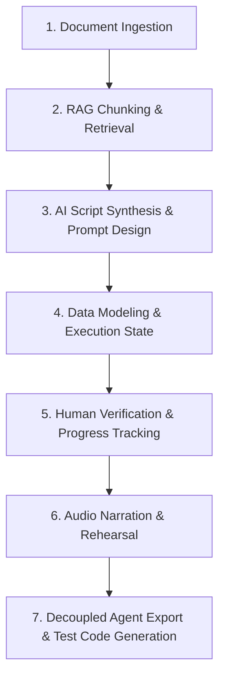

# Architecture Decision Record — Demo Script Builder

This document records the engineering decisions made while building the Demo Script Builder, following standard ADR (Architecture Decision Record) practice: for each decision area we state the **problem**, the **options considered** (including rejected ones), the **decision reached**, and the **consequences** (resilience, scale, cost, maintainability).

**Pipeline covered:**

---

## 1. Document Ingestion & Source Extraction

**Status:** Accepted · **File:** `app/api/scrape/route.ts`

### Context
The system needs to accept product documentation across formats (URLs, PDFs, markdown, plain text) and turn it into clean, high-density text — without heavy infrastructure overhead, and without feeding LLMs site navigation clutter.

### Options Considered
| Option | Trade-off |
|---|---|
| Headless browser scraping (Puppeteer / Playwright) | Accurately renders dynamic SPAs, but ~200MB+ RAM per request, high serverless cold-start latency, expensive compute |
| Third-party scraping APIs (Firecrawl / ScrapingBee) | High reliability, but per-request cost, added latency, vendor dependency |
| **Lightweight HTML parser (Cheerio) + PDF fallback stream parsing** ✅ | Instant in-memory execution, zero extra infra cost, zero external service dependency |

### Decision
Use **Cheerio** for HTML scraping with custom tag stripping (`<script>`, `<style>`, `<nav>`, `<footer>`), a **30,000-character cap** post-cleaning to control context window size, and a **two-tier PDF parser**: primary via `pdf-parse`, falling back to regex-based binary stream parsing (`Tj`/`TJ` text operators) for non-standard PDF encodings.

### Consequences
| Failure scenario | System response | Why it doesn't break |
|---|---|---|
| PDF parser crashes on exotic encoding | Regex-based binary stream fallback extracts text | Two extraction methods cover ~95% of real-world PDFs |
| Scrape target returns 403/500 | Error propagated to user with a clear message | No silent failures, no corrupted state |

**Cost:** Cheerio over Puppeteer is **$0** vs. ~$0.01/scrape for headless browser compute.
**Scale:** 30K char cap + chunking keeps LLM token cost predictable regardless of document size.

---

## 2. Knowledge Chunking & RAG Retrieval

**Status:** Accepted · **File:** `lib/llm/rag.ts`

### Context
Large documentation needs to be chunked without splitting information mid-sentence or losing it at boundaries, and retrieval must keep working even if embedding API keys are restricted or unavailable.

### Options Considered
| Option | Trade-off |
|---|---|
| Third-party vector DBs (Pinecone / Weaviate) + LangChain | Turnkey vector indexing, but dependency bloat (50+ sub-packages), separate billing, cross-database sync issues |
| **Custom RAG engine in MongoDB + multi-tier fallback cascade** ✅ | Low complexity (~100 LOC), zero added infra cost, stored alongside demo documents |

### Decision
- **Chunking:** 800-character windows with 150-character overlap, breaking at the nearest word boundary to preserve sentence coherence.
- **Embedding fallback cascade (3 tiers):**
  1. `text-embedding-004` (primary Gemini embedding model)
  2. `embedding-001` (legacy fallback)
  3. Direct Text RAG — raw chunk text passed straight to the LLM (positional fallback)
- **Retrieval:** in-memory cosine similarity over chunks stored in the `KnowledgeChunk` MongoDB collection, avoiding an external vector database entirely.

### Consequences
| Failure scenario | System response | Why it doesn't break |
|---|---|---|
| Gemini embedding API returns 404 | Falls back to `embedding-001`, then Direct Text RAG | Three-tier cascade ensures scripts are always generated |

**Scale:** each demo's chunks are scoped by `demoId`, so no cross-demo interference in retrieval.
**Cost:** MongoDB for vectors instead of Pinecone/Weaviate adds **$0** additional infrastructure.

---

## 3. AI Script Synthesis & Prompt Design

**Status:** Accepted · **Files:** `lib/llm/prompt.ts`, `lib/llm/generateScript.ts`

### Context
The LLM must not hallucinate features absent from the source documentation, and its output must be machine-parseable JSON every single time, not "usually."

### Options Considered
| Option | Trade-off |
|---|---|
| Unstructured output + regex parsing | Fragile — breaks whenever the LLM adds markdown formatting or commentary |
| **Gemini 2.5 Flash + isolated prompt architecture + self-healing Zod validation loop** ✅ | Deterministic JSON shape, prompt logic isolated from application logic |

### Decision
- **Grounding rule:** every step must include a verbatim `sourceRef` excerpt (<300 chars) from retrieved knowledge chunks, to eliminate hallucinated features.
- **Action matrix:** step actions constrained to 7 explicit types — `navigate`, `click`, `input`, `highlight`, `wait`, `say`, `scroll`.
- **Narrative arc:** model is instructed to structure 5–12 steps sequentially (Orient → Build Core Value → Call-to-Action).
- **Self-healing auto-repair loop:** a 2-attempt retry loop in `generateScript.ts`. If attempt 1 produces invalid JSON or a Zod schema violation, the exact Zod error is fed back to Gemini on attempt 2 to self-repair.
- Strict JSON is enforced via Gemini's `responseMimeType: "application/json"`.

### Consequences
| Failure scenario | System response | Why it doesn't break |
|---|---|---|
| LLM returns malformed JSON | Zod validation catches it, retries with error feedback | Self-repair loop fixes most formatting issues on the second attempt |

**Cost:** capped at 2× LLM cost per generation (bounded, not unbounded retries). Gemini Flash is ~5–10× cheaper per token than GPT-4/Claude for equivalent structured-output quality.
**Maintainability:** prompt logic lives in its own file, so sales/content teams can tune demo voice without touching RAG or validation code.

---

## 4. Data Modeling & Execution State

**Status:** Accepted · **Files:** `lib/types.ts`, `lib/models/Demo.ts`

### Context
Should human-authoring state (review status, notes) and agent-execution state (action, target, value) live in separate schemas, and how should edits made after generation be tracked?

### Options Considered
| Option | Trade-off |
|---|---|
| Dual models (authoring schema vs. execution schema) | Leads to synchronization drift between human edits and agent execution code |
| **Unified Step Model with on-the-fly contract stripping** ✅ | Single source of truth for both human editing and automated execution |

### Decision
Combine agent execution fields (`action`, `narration`, `target`, `value`) and human authoring metadata (`status`, `notes`, `sourceRef`) into a **single document model**. Implement **automatic versioning**: any update to demo steps increments `version` (`$inc: { version: 1 }`), letting external agent runners detect mid-demo edits.

### Consequences
The trade-off is that the export layer must strip human metadata at read time — but this is a cheap, stateless O(n) map over steps, not a real cost.

**Maintainability:** Zod schemas in `types.ts` are the source of truth — adding a new step field means updating one schema, and TypeScript enforces it everywhere downstream.

---

## 5. Human Review & Verification Pipeline

**Status:** Accepted · **File:** `components/Editor.tsx`

### Context
Sales engineers need confidence that an AI-generated script is ready for live clients, and need to track review progress incrementally across 10+ step demos without re-reviewing everything on every change.

### Options Considered
| Option | Trade-off |
|---|---|
| All-or-nothing approval | Simple, but forces a full re-review even when only one step changed |
| **Granular step-level lifecycle & progress metric** ✅ | Clear state transitions per step |

### Decision
- **Step lifecycle:** `generated` (AI default) → `edited` (modified by a human) → `verified` (explicitly confirmed).
- **Progress tracking:** `percentVerified = (verifiedCount / totalSteps) × 100`, computed in real time.
- **Audit trail:** reviewer notes formatted as `[Reviewer - YYYY-MM-DD]: comment`, giving an immutable review trail for compliance and handoff.

### Consequences
**Trust:** granular statuses give sales teams confidence that a script is client-ready without re-reviewing untouched steps.
**Compliance:** timestamped notes create a handoff record between reviewers.

---

## 6. Audio Narration & Interactive Rehearsal

**Status:** Accepted · **File:** `components/Player.tsx`

### Context
Presenters need to rehearse spoken narration without paying cloud text-to-speech fees or adding API-key setup friction.

### Options Considered
| Option | Trade-off |
|---|---|
| Cloud speech APIs (ElevenLabs / Google Cloud TTS) | High voice quality, but per-character cost, latency, and API key setup |
| **Browser-native Web Speech API (`window.speechSynthesis`)** ✅ | Instant playback, zero cost, works offline |

### Decision
Integrate `window.speechSynthesis` directly into the interactive step player for instant, zero-latency narration during manual or auto-advancing rehearsal.

### Consequences
| Failure scenario | System response | Why it doesn't break |
|---|---|---|
| User's browser doesn't support TTS | Graceful toast error; player still works for non-voice steps | TTS is additive, not required for core functionality |

**Cost:** **$0** vs. ~$0.01–0.10/utterance for cloud TTS.

---

## 7. Decoupled Agent Export & Multi-Format Generation

**Status:** Accepted · **Files:** `app/api/demos/[id]/export/route.ts`, `lib/exportGenerators.ts`

### Context
Automated agents and QA test suites need clean, executable scripts — not raw database dumps polluted with authoring metadata (`sourceRef`, `notes`, `status`, `_id`).

### Options Considered
| Option | Trade-off |
|---|---|
| Raw database dump | Exposes internal DB fields to external agent runners; couples DB schema to consumers |
| **Decoupled API contract + multi-format code generators** ✅ | Clean contract; UI/DB schema can evolve independently of consumers |

### Decision
Expose `GET /api/demos/[id]/export`, which strips internal fields at read time and returns a clean `AgentRunnableScript` payload. Provide code generators for **Playwright** (`formatStepsToPlaywright`) and **Puppeteer** (`formatStepsToPuppeteer`), plus JSON, YAML, Markdown, and plain text formats — turning demo scripts directly into executable browser-automation test suites.

### Consequences
**Maintainability:** adding review features (comments, approval chains) never breaks agent integrations, since the export contract is decoupled from the internal schema.
**Scale:** export is stateless field-stripping, O(n) in step count — no caching or precomputation needed.

---

## Cross-Cutting Decisions

A few decisions support the whole system rather than one pipeline stage:

| Decision | Rationale |
|---|---|
| **Global Mongoose connection cache** — reuses connections across serverless invocations | Prevents connection pool exhaustion in the Next.js serverless environment; `conn.readyState` is checked before reuse |
| **SSE progress pipeline** — server-sent events during generation | Keeps the user informed during the 10–30 second generation process |
| **Single database (MongoDB for both documents and vectors)** | One backup strategy, one connection pool, one operational surface |
| **Stateless API routes on Next.js serverless functions** | No shared in-memory state between requests; concurrent users scale horizontally for free |

---

## Summary Matrix

| # | Decision Area | Problem Asked | Solution Reached | Primary Benefit |
|---|---|---|---|---|
| 1 | Ingestion | Scrape/parse without high cost? | Cheerio HTML + PDF regex fallback | Fast execution, zero extra infra cost |
| 2 | Chunking/RAG | Ensure RAG never fails? | 800-char windows + 3-tier embedding cascade | Script generation always succeeds |
| 3 | AI Synthesis | Eliminate hallucinations, guarantee JSON? | `sourceRef` grounding + 2-attempt Zod auto-repair | Strict schema compliance |
| 4 | Modeling | Avoid editor/agent sync drift? | Unified Step Model + version incrementing | Single source of truth, change detection |
| 5 | Review | Track review completion? | Granular step statuses + progress bar | High trust for sales team |
| 6 | Audio | Narration without API fees? | Browser Web Speech API | Zero latency, zero cost |
| 7 | Export | Support agents & QA tests? | Decoupled export contract + code generators | Multi-format, no consumer breakage |

---
